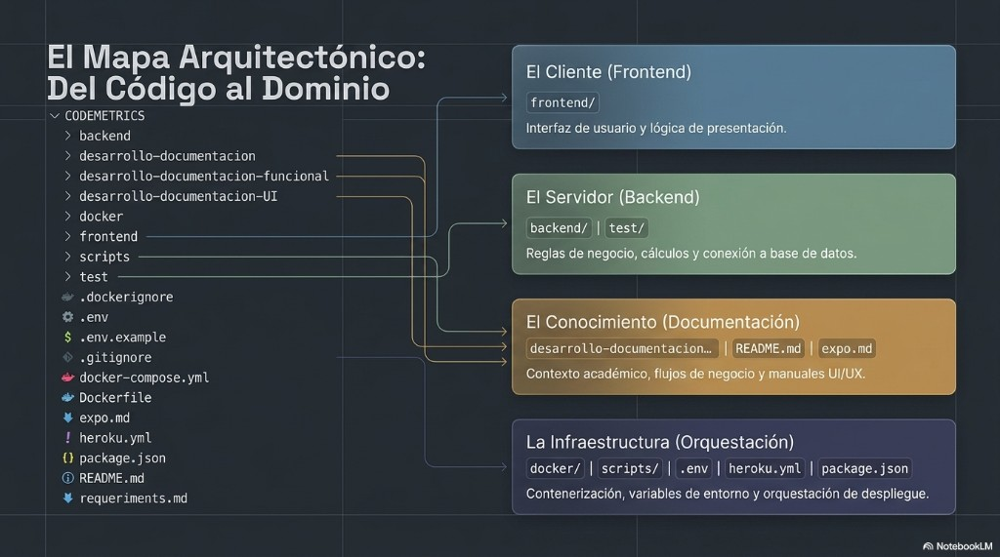
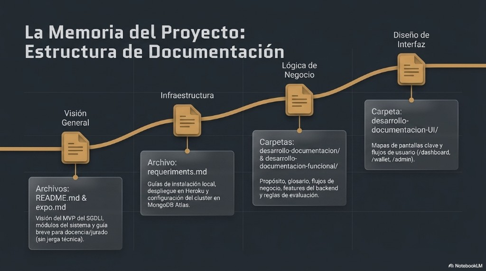
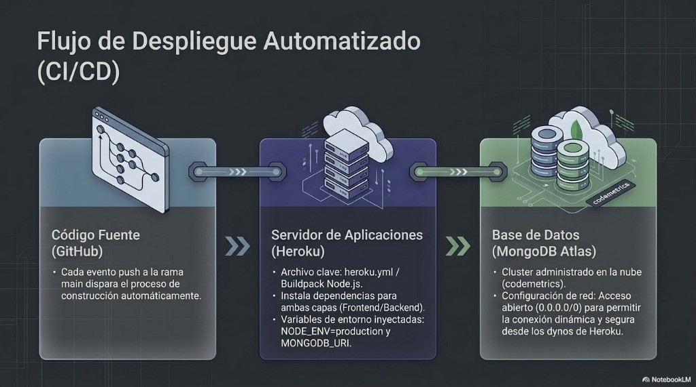
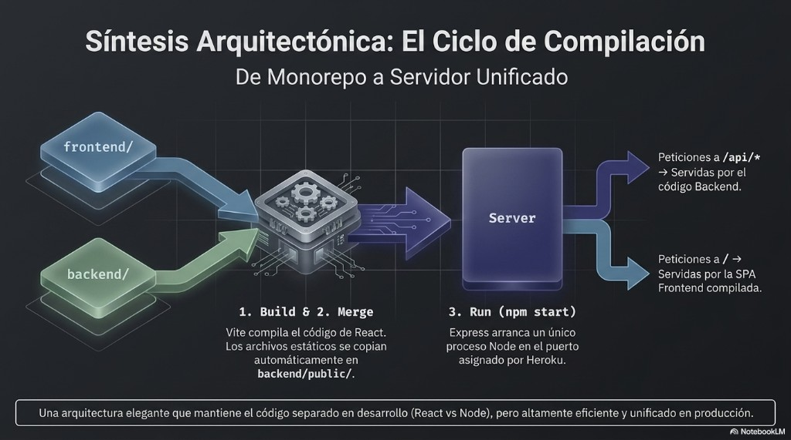

# CodeMetrics

**Sistema de Gestión del Desempeño e Incentivos Laborales (SGDLI)** — plataforma web académica que simula cómo una empresa de tecnología mide el rendimiento de sus equipos IT y lo convierte en incentivos concretos.

> ¿Cómo reconocemos y premiamos el buen trabajo de desarrolladores y personal técnico de forma medible, trazable y motivadora?

---

## Visión general

CodeMetrics cierra el ciclo **evaluar → puntuar → acumular → canjear → supervisar**:

1. Se mide el desempeño mensual con **KPIs** (calidad, entrega, bugs, colaboración, innovación).
2. Se calcula una **nota final** y los **Puntos de Mérito** asociados.
3. Los puntos se registran en una **billetera auditable** (cada movimiento queda en historial).
4. El empleado los gasta en una **tienda interna** de recompensas.
5. **RRHH** aprueba, rechaza o marca entregados los canjes desde un panel administrativo.

La demo usa un **selector de usuario simulado** (sin login real) y datos ficticios generados con `npm run seed`.

---


## Mapa arquitectónico

El repositorio se organiza en cuatro dominios: **cliente**, **servidor**, **documentación** e **infraestructura**.


| Dominio                | Carpetas / archivos                                         | Rol                                         |
| ---------------------- | ----------------------------------------------------------- | ------------------------------------------- |
| **Cliente (Frontend)** | `frontend/`                                                 | Interfaz y lógica de presentación           |
| **Servidor (Backend)** | `backend/`, `test/`                                         | Reglas de negocio, cálculos y conexión a BD |
| **Conocimiento**       | `desarrollo-documentacion*/`, `README.md`                   | Contexto académico, flujos y manuales UI    |
| **Infraestructura**    | `docker/`, `scripts/`, `.env`, `heroku.yml`, `package.json` | Contenedores, variables y despliegue        |


---


## Roles y pantallas


| Rol               | Rutas principales                                                                       | Qué puede hacer                                                      |
| ----------------- | --------------------------------------------------------------------------------------- | -------------------------------------------------------------------- |
| **Empleado**      | `/dashboard`, `/wallet`, `/store`, `/evaluations`, `/goals`                             | Ver KPIs y nota, consultar billetera, canjear premios, autoevaluarse |
| **Administrador** | `/admin`, `/admin/rewards`, `/admin/redemptions`, `/admin/wallet`, `/admin/evaluations` | Métricas globales, catálogo, canjes, ajustes de puntos, revisiones   |


---


## Módulos del sistema


| Módulo           | Responsabilidad                                           |
| ---------------- | --------------------------------------------------------- |
| **Empleados**    | Personas, roles, áreas y saldo de puntos                  |
| **Desempeño**    | Periodos mensuales, KPIs, nota y puntos calculados        |
| **Evaluaciones** | Autoevaluación, revisión del supervisor y cierre          |
| **Billetera**    | Historial de abonos, débitos, reembolsos y ajustes        |
| **Recompensas**  | Catálogo de la tienda (licencias, cursos, hardware, etc.) |
| **Canjes**       | Tickets de canje con flujo de aprobación RRHH             |
| **Objetivos**    | Metas por empleado *(demo en frontend, sin API aún)*      |


---


## Stack y arquitectura

Monorepo con dos capas que se comunican por **API REST** (JSON):

```text
frontend/   React 19 + Vite + Ant Design (MVC ligero por feature)
backend/    Express 5 + Mongoose (vertical slices en src/features/)
```

En **producción**, un solo proceso Express sirve la API (`/api/`*) y el frontend compilado (`/`).

```text
Navegador  →  Heroku (Node/Express)  →  MongoDB Atlas
```


| Capa          | Tecnología                                       |
| ------------- | ------------------------------------------------ |
| Frontend      | React 19, Vite 7, Ant Design 6, React Router 7   |
| Backend       | Node.js 24, Express 5, Mongoose 9                |
| Base de datos | MongoDB Atlas (`codemetrics`)                    |
| Hosting       | Heroku — deploy automático desde GitHub (`main`) |
| Datos demo    | Faker.js — seed manual                           |


---


## Arranque rápido (local)

1. Copia `.env.example` a `.env` y configura `MONGODB_URI` (MongoDB Atlas).
2. Instala y levanta:

```bash
npm run install:all
docker compose up --build
```


| Servicio       | URL                                                                  |
| -------------- | -------------------------------------------------------------------- |
| Frontend (dev) | [http://localhost:5173](http://localhost:5173)                       |
| Backend API    | [http://localhost:3000/api](http://localhost:3000/api)               |
| Health check   | [http://localhost:3000/api/health](http://localhost:3000/api/health) |


1. Poblar datos de demostración:

```bash
npm run seed
```

---


## Producción local y Heroku

```bash
npm run build        # Compila React → backend/public/
npm run start:prod   # API + SPA en un solo puerto
```

En **Heroku**, cada push a `main` dispara el build. Config Vars requeridas:


| Variable      | Valor                      |
| ------------- | -------------------------- |
| `MONGODB_URI` | Cadena de conexión a Atlas |
| `NODE_ENV`    | `production`               |


Tras el primer deploy, ejecutar el seed una vez si la BD está vacía: `heroku run npm run seed`.

Guía detallada: `[requeriments.md](./requeriments.md)`.

---


## Documentación


| Recurso                                                                        | Contenido                                   |
| ------------------------------------------------------------------------------ | ------------------------------------------- |
| `[requeriments.md](./requeriments.md)`                                         | Requisitos, Atlas, Heroku y troubleshooting |
| `[desarrollo-documentacion/](./desarrollo-documentacion/)`                     | Features del backend                        |
| `[desarrollo-documentacion-UI/](./desarrollo-documentacion-UI/)`               | Pantallas del frontend                      |
| [`desarrollo-documentacion-funcional/`](./desarrollo-documentacion-funcional/) | Propósito, glosario y flujos de negocio |

**Mapa arquitectónico — del código al dominio**



**Estructura de documentación**



**Flujo de despliegue automatizado**



**Ciclo de compilación — de monorepo a servidor unificado**


